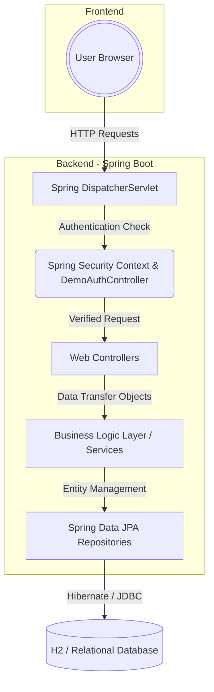

# Grand Horizon Hotel Reservation System 🏨

A comprehensive, production-ready Hotel Reservation System built with a powerful **Spring Boot** backend and an elegantly designed **Thymeleaf + Bootstrap 5** frontend. This application was built to simulate a premium, high-traffic property booking platform.

## ✨ Key Features
- **Dynamic Search:** Location and city-based advanced room availability filtering.
- **Showcase Social Login:** Seamlessly bypasses complex cloud configs with an internal "Demo-Mode" Google & Apple Login implementation (instant offline authentication perfect for college presentations).
- **Security:** Fully protected routing via Spring Security (Form-Login + Role-based access control).
- **Responsive UI:** A stunning, premium frontend completely overhauled with modern aesthetics, completely avoiding generic styles.
- **Admin Dashboard:** Total management of rooms, bookings, and system users. 
- **Database:** Auto-migrating H2 In-Memory Database for instant setup, completely swappable for MySQL/PostgreSQL.

## 🏗️ Architecture Flow Diagram
The application follows a standardized deeply-integrated MVC (Model-View-Controller) architecture flow.



## 🚀 How To Run Locally
1. Ensure you have **Java 17+** and **Maven** installed on your machine.
2. Clone this repository: `git clone https://github.com/Ayushnot41/hotel-reservation-system.git`
3. Navigate to the project directory.
4. Run the Spring Boot application using the wrapper:
   ```bash
   ./mvnw clean spring-boot:run
   ```
5. Open your browser and visit: `http://localhost:8080/`

## 👨‍💻 Default Testing Credentials
**Admin Authentication**
- **Email:** `admin@hotel.com`
- **Password:** `admin123`

**Normal User**
- *Either securely create one via the Signup page, or simply click the "Continue with Google" button for an instant simulated bypass login.*

## ☁️ Deployment Strategy
This Spring Boot application is optimized for deployment on containerized environments or platform-as-a-service providers like **Render.com**, **Railway**, or **AWS Elastic Beanstalk**. 

*(Note: Standard serverless frontend platforms like Vercel or Netlify do not natively support Java applications. Use Render or Railway for instant deployment by linking this repo).*

### Render.com Configuration Settings:
* **Environment:** Java
* **Build Command:** `./mvnw clean package -DskipTests`
* **Start Command:** `java -jar target/reservation-1.0.0.jar`
