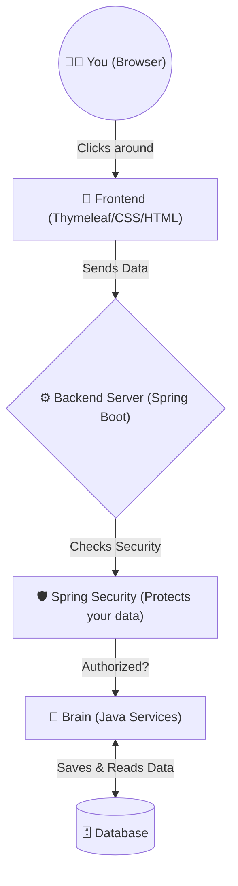
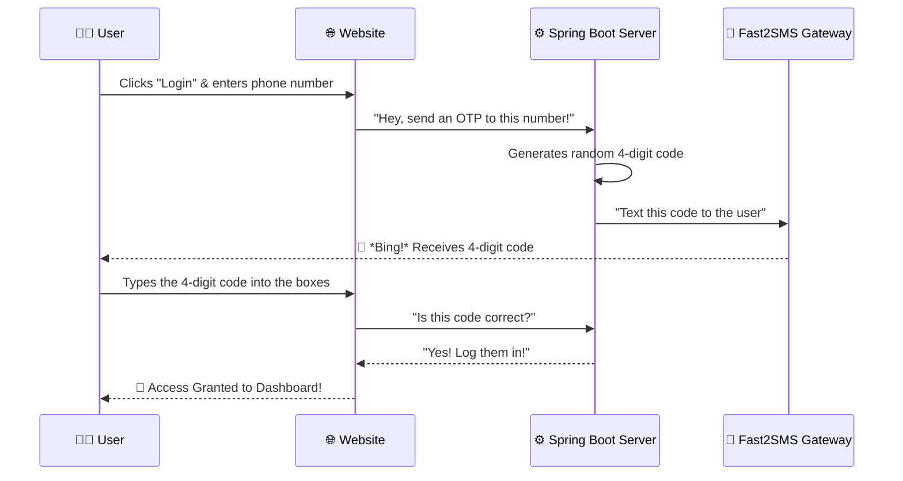

# 🏨 Grand Horizon Hotel Reservation System

Welcome to the **Grand Horizon Hotel Reservation System**! 

This project is a fully-functional, production-ready website where users can search for hotels, view rooms, and make bookings just like popular sites (like GoIbibo or MakeMyTrip). 

I built this project to be fast, secure, and extremely beautiful. It uses a **Spring Boot** server for all the heavy lifting and a **Thymeleaf + Bootstrap 5** frontend that feels like a modern native app!

---

## 🌟 What Can This Project Do? (Features A-Z)
Here is a complete list of everything this system can do, explained simply:

*   **A - Automated OTP Login:** Users don't need passwords! They can log in instantly using their phone number and a secure 4-digit code sent via SMS.
*   **B - Beautiful User Interface (UI):** Every button and card has hardware-accelerated, smooth animations. It feels premium and NEVER lags.
*   **C - City-Based Search:** Search for hotels across 16+ popular tourist destinations in India (Mumbai, Delhi, Goa, Jaipur, Udaipur, and more!).
*   **D - Database Integration:** Uses an internal H2 database to store users and room details automatically.
*   **E - Enterprise Grade Security:** Built with Spring Security to keep hackers out and user data safe.
*   **F - Fast2SMS Gateway:** Real integration to send actual text messages to users' phones during login.
*   **G - Global Modals:** The login popup is smart. It loads instantly on any page when you need it without reloading the website.
*   **R - Role-Based Dashboards:** Regular users see their booking history, while "Admins" get a special control panel to add new rooms and manage the exact business details.

---

## 🗺️ How It Works (Simple Diagrams)

To make it easy to understand, here are flowcharts showing exactly how the puzzle pieces fit together!

### 1. The Big Picture (System Architecture)
This shows how the user's computer talks to our server to get data from the database.

### 2. The Smart OTP Login Flow 
Here is exactly what happens when you type your phone number to log in!

---

## 🛠️ Technology Stack (What I Used)
*   **Frontend (What you see):** HTML5, CSS3 (with GPU-accelerated animations), JavaScript, Bootstrap 5.
*   **Backend (The brain):** Java 17, Spring Boot 3.2.
*   **Security:** Spring Security (CSRF protection, session management).
*   **Database:** H2 In-Memory Database (Stores data instantly without complex setups).
*   **Messaging:** Fast2SMS API for real-time mobile texting.

---

## 🚀 How to Run This on Your Computer

It is incredibly easy to run this project yourself! You don't need any complicated database setup. Just follow these steps:

### Prerequisites:
Make sure you have **Java 17** installed on your computer.

### Steps:
1. **Download the project**
   Open your terminal/command prompt and type:
   `git clone https://github.com/Ayushnot41/hotel-reservation-system.git`
   
2. **Open the folder**
   `cd hotel-reservation-system`

3. **Start the server!** 
   Type this command and hit enter:
   `./mvnw clean spring-boot:run`
   *(If you are on Windows, use `mvnw.cmd clean spring-boot:run`)*

4. **View the website!**
   Open your favorite web browser (like Chrome or Safari) and go to:
   👉 **`http://localhost:8080/`**

---

## 🔑 Default Test Accounts
Want to test the admin features? Use these credentials on the Login page!

**👨‍💼 Admin Panel Access**
*   **Email:** `admin@hotel.com`
*   **Password:** `admin123`

**🧑‍💻 Normal User**
*   Just click the **Login** button on the top right, enter your actual phone number, and test the amazing OTP flow! (Or use the Google fake-login button to skip). 

---

## ☁️ How to Put It on the Internet (Deployment)
If you want to show this to the world, use a service like **Render.com**.
1. Create a free Render account.
2. Select **"Web Service"** and connect this exact GitHub repository.
3. Set the Environment to **Java**.
4. Set the Build Command to: `./mvnw clean package -DskipTests`
5. Set the Start Command to: `java -jar target/reservation-1.0.0.jar`
6. Click deploy and watch it go live!

*(Note: Don't forget to add your `fast2sms.api.key` securely in Render's environment variables if you want texts to keep working in production!)*

---
*Built with ❤️ for a modern, seamless booking experience.*
